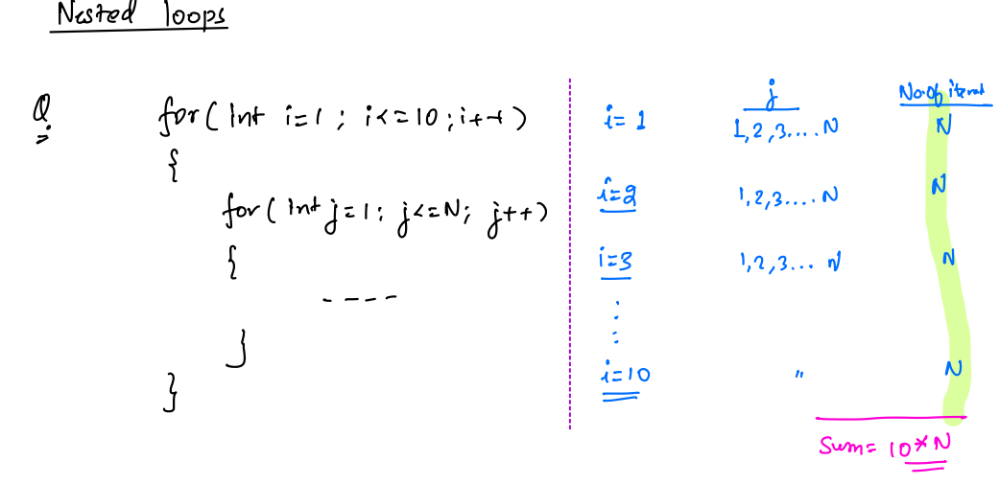

what is a factor - 

 If N  is a natural number, A factor is a no that divides N without leaving a remainder.
 
 N =12, factors = 1, 2, 3, 4, 6, 12
 
 Count no of factors of a given no N, N >0.
 
N % f == 0 then f is the factor of no N.

The minimum value of the factor is 1.

and the maximum value of the factor will be N.

Q. Count the number of factors in N.

 code - 
 
 N=12;
 
  cnt = 0
  
  for( int i =1; i <= n; i++){
  
  if( N % i == 0 ) 
  cnt++;
  }
  
What is iteration? It is the number of times the for loop will run.
  
in this case, no of iterations will be N as the loop is starting from the 1.
  
Assumption - every server is capable of running 10^8 iterations in 1 Sec.
 
if a * b = N then we can say that a and b both can be the factors of N.
 
for N = 24 
 
a	b
1	24
2	12
3	8
4	6

6	4
8	3
12	2
24	1

after a becomes greater than b then factors start repeating.

so we will count the no of factors till a <= b.

so instead of iterating from 1 to N, lets iterate till a <= b.

so we can say at some point b will be equal to a.

a <= N/a

a * a <= N
 
 code - 
 
 cnt =0;
 
 for( a=1; a*a <= n ; a++) {
 
 if( n % a == 0) {
 
 b = n/a;

if( a ==b){
cnt++;
}else{
 cnt = cnt+2;
 }
}
}

no of iterations in the above code is sqrt of N.

What is prime no - 

  Given N, check if N is prime or not.
 Prime no  - this no has the count of factors == 2 and the prime number is a natural no.
 
Note - In problem-solving when we are finding out the definition of something we have to think about all the corner cases, everything that’s possible.
 
prime no is a no divisible by 1 and itself only.
 
1) 1 and itself as a factor
2) no of factors > 2
3) no of factors == 2
 
 
from definition no 1, one is a prime no but one is not a prime no.
 
definition 3 works for all cases including one, so we will go with the 3rd definition.
 
 
Q. write a code to check whether no is prime or not.
 
 
cnt=0;
 
for(int i =1; i <= n; i++){
 
if( n%i == 0)
cnt++; // counting no of factors.
}
 
if( cnt == 2)
print("no is prime no");
else
print("No is not prime no");
 
 
Time complexity analysis of the above brute force -
 
Note - 10^8 iterations happen in 1 second. and for time analysis only loops are considered as other statements take constant time.
 
For value N above, the loop runs for N times ( i.e. N Iterations).
 
so for input 10^9, 10^9 iterations are performed so the time taken to solve this question for provided input is 10^9 / 10^8  seconds.
 
so it will take 10 seconds to solve for the above input.
 

  
 
if input is 10^18 then 10^18 iterations will occure and time taken by it is 10^18 / 10^8 = 10^10 seconds which is approximately 317 years.
 
factors always occur in pairs-
for n =16
 
1 * 16
2 * 8
4 * 4
8 * 2
16 * 1
 
after sqrt(n) factor starts repeating. 
 

 
we get all the factors in part 1 where A <= B only, there is no need to search for factors in the second part where A > B.
 
for part 1  a <= b
 
for the above condition to become true, the max value of a will be b.
 
a * b = n
at the maximum value - b * b = n = b^2 = n.
value of b will become sqrt(n).
 
part 1 is going to end at a = sqrt(n).
 
Code - 

 
 cnt =0;
 
 for( a=1; a*a <= n ; a++) {
 
 if( n % a == 0) {
 
 b = n/a;

if( a ==b){
cnt++;
}else{
 cnt = cnt+2;
 }
}
}

if ( cnt ==2 ) 
print("Yes no is prime no");
else
print("No no is not prime");

no of iterations = sqrt(n)

 
Defination of prime no -
 
1 to n - no of factors == 2
 
1 to sqrt(n) - no of factors == 1
 
2 to sqrt(n) - no of factors == 0
 
for(int i =2 ; i * i <= n ; i++){
if( n% i ==0)
{
return false; // no is not prime
}
}
return true; // It is prime no.
 
above code runs for sqrt(n) times.
 
if our input is 10^10 then sqrt(10^10 ) iterations will occure and it will take 10^5/10^8 = 10^-3 = 1 milli seconds to find the ans.
 
 
and for 10^18, 10^9 iterations will occure, which will take 10^9/10^8 = 10 seconds to get the output.
 
We have to have great observation to solve problems. by using observations we can solve them in an optimised way.
 
Sum of first n natural nos = n * ( n +1) / 2
 
gauss derived the above formula
 
Q. Given n, how many times do we need to divide by 2 to make it 1 ?
 
15/2 -> 7/2 -> 3/2 -> -> 1  3 times we have to divide by 2.
 
how many times you will have to divide 2^n by 2 to make it 1 -. n times.
 
for any no n,
2^x = n
x = logn to the base 2.
 
a^x = n -> x = logn to the base a.
  
so given n, how many times do we need to divide by 2 to make it 1?
 
 ans = floor( logn to the base 2)
 
Interview question -
Q. find the Square root of a no (perfect square).
 
for n =100, the square root can be from 1 to 100.
 
for( int i =1; i <=n;i++){
 
// check if i is a square root
if( i* i == n)
{ print( i) ;
break;
}
}
 
above loop runs sqrt(n) times.
 
there fore no of iterations = sqrt(n).
 
n = 10^10 iterations = 10^5, time taken will be 10^5/10^8 = 1 mili seconds.
 
n=10^18, iterations = 10^9, time taken = 10 second.
 
 Optimized - 

code -
 
l=1
r=n
 
while( l <= r){
 
mid = l+r /2;
 
if(mid * mid == n){
// found sqrt of n
print(mid);
break;
}
else if( mid * mid > n){
// search in left side
r=mid-1;
}
else {
 
// search in right side
l= mid+1;
}
}
 
TC - log(n)
SC - o(1)
 
conclusion -
 
reduce the no of iterations to optimize the solution.
 
by using observations we can reduce the no of iterations and dry run the code to understand  it completely.

Time Complexity 1

   

How many steps are required to divide a no to make it 1?

 

log(n)- log n to base 2.

 

Prerequisite maths -

 

Interval - [2,7] --> { 2, 3, 4,5 6, 7} --> 2 and 7 are both inclusive.

 

(3, 8) --> { 4, 5, 6, 7} --> 3 and 8 are not included.

 

[10,14] --> {10, 11, 12, 13, 14} --> 10 and 14 are included.

 

[a,b] is called a closed interval, and (a,b) is called an open interval.

 

[a,b] --> total nos in this range = b-a+1.

 

(a,b) --> total nos in the range is = b-a-1

 

[3,7) --> { 3, 4, 5,6}

 

(4,9] --> { 5, 6, 7,8, 9}

 

(a,b] = b-a.

[a,b) = b-a

 

Arithmatic progression ->

 

It is a series of nos with a common difference.

 

4, 7, 10, 13, 16, 22

here the common difference is 3.

 

a - first term

d -common difference

 

a, a+d , a+2d, a+3d, a+4d.

 

Sum of AP = n/2 * ( 2*a +( n-1)*d )

 

here n is no of terms, a is first term, d is common difference.

 

Geometric progression -

 

5 10 20 40 80 160

 

a: first term

r: common ratio

n: no of terms

 

a,a*r, a*r^2, a * r^3, a*r^4

 

sum of n terms of GP = a * ( r^n -1)/ (r-1).

 

r= second term / first term.

 

 

here r is common ratio and n is no of terms and a is first term.

 

find no iterations are happening in this block ->

 

Q.

 

for (int i =1 ; i <= n; i++){

s= s+i;

}

 

it start at 1 and end at N --> [1,N] therefore there are total N iterations happening.

 

Q. func(){

        for(int i = 1; i <= N; i++){

            if(i % 2 == 0){

                print(i);

            }

        }

        for(int j = 1; j <= M; j++){

            if(j % 2 == 0){

                print(j);

            }

        }

}

 

N + M - iterations are happening.

 

Q.

for(i=1; i*i <= N; i++)

{

        ...

}

 

sqrt( N ) iterations.

 

Q.

 

N>0

i=N;

while(i>1)

{

        i=i/2;

}

 

log(n) iterations.

lets say loop stops after 'x' iterations and value of i after xth iteration = N / 2^x

 

when i =1 then loop will break.

 

N/2^x = 1

 

N = 2^x

 

Take log on both sides,

 

log(n) = log(2^x)

 

log(n) = x * log(2)

 

x = log(N) to the base 2.

 

loop will break after log(N) iterations.

 

Q.

 

for(i=0; i<=N; i = i*2)

{

        ...

}

 

 

here i start from 0 so this loop will never end.

 

Q.

 

for(i=1; i<N; i=i*2)

{

        ...

}

 

log(n) iterations will occur.

Lets assume loop breaks after x iterations,

value of i after xth iteration = 2^x

 

value of i when loop breaks it will be greater than or equal to N.

 

2^x >= N

 

log(2^x) >= log(N)

x >= log(N)

 

loop breaks after log(N) iterations.

 

Q.

 

for(i=1; i<=10; i++){

        for(j=1; j<=N; j++){

        /     ......../

        }

}

 

10 * N iterations.

Q.

for(i=1; i<=N; i++){

        for(j=1; j<=N; j++){

            ...

        }

}

 

N^2 iterations.

Q.

 

for(i=1; i <= N; i++){

        for(j=1; j <= N; j = j*2){

            ...

        }

}

 

N * log (n) iterations will occur.

Q.

How many iterations (for the inner loop in total) will be there in this program (no of times the inner loop runs) ?

s = 0

for (int i=0;i<N;i++) {

  for (int j=0;j<=i; j++) {

        s += 1 }}

Q.

 

for(i=1; i<=N; i++){

        for(j=1; j<=(2^i); j++)

        {

            ...

        }

}

 

 

Important formulas -

log of 'a' to the base 'b' is equal to 'c' -> b^c = a

Time Complexity 2

Every program, no of iterations in the code is dependent on some input N.

 

I(N) : no of iterations in the code.

 

I(N) - N^2

I(N) - N + NlogN +2^N

 

How to compare two algorithms -

 

Time and Space.

 

 The execution time of a code is dependent on -

 

Programming language.

Environment Conditions.

Hardware.

 

Execution time is not a good criterion for checking the performance.

 

No of iterations is a good idea to calculate the performance of the algorithm.

we should build algorithms in such a way that they should be optimized for large N.

 

Asymptotic analysis - it compares two algorithms when N tends to infinity (or for higher inputs).

 Analysis of algorithms on very large input.

If big o of two algorithms same then compare their no of iterations.

and big O only works for the very large values of N.

It means analyzing the performance of the algorithm on larger inputs.

 

I(N) is converted to a standard and that standard is called as Big O notation.

 

Mathematical relation -

 

1 < logn < sqrt(n) < n < nlogn < nsqrt(n) < n^2 < n^3 < 2^n < n!

How to convert to big-O notation?

 

1) Get the no of iterations - I(N).

2) Neglect lower order terms.

3) Ignore constant coefficients.

Standard names for complexities -

 

O(1) - Constant

O(logn) : logarithmic

 

O(n) : linear

O(nlogn) : Lear logarithmic

 

O(n^2) : quadratic - Polynomial

O(n^4) : cubic - Polynomial

 

O(2^n) : exponential

why do we ignore higher order terms ?

 

let's consider no of iterations function - I(N) = N^2 + N

 

for N =1

 

I(N) will become = 1+1 ( each term has 50 % contribution)

 

for N = 10

 

I(10) will become = 100 + 10 --> First terms has 91% and second term has 9% contribution in no of iterations

 

for N =100

 

I(100) will become = 10^4 + 100 -->

First term willl contribute 99% to the no of iterations and second term will contribute 1% no of iterations.

 

for N=10^8

 

I(10^8) will become = 10^16 + 10^8 -->  first term will contribute to 99.999999% of iterations and second term will contribute to 0.00000001% iterations.

 

smaller terms has very very extremenly low contribution in the no of iterations of the alogorithm so we always ignore the lower order terms.

 

 

O(1) complexity - for( int i =0; i < 100 ; i++){....}

 

O(100) --> O(1)

 

 

Issues with big o notation -

 

It does not work in smaller inputs.

 

I(N) = 4*N^2 + 5

I(N) = 10000 N^2 + 100 N +1000000

 

The first equation has a smaller no of iterations still according to the big o notation both equations are equal.

 

So big o cannot be used to compare between same time complexity.

 

 

Space complexity -

 

Space complexity - the maximum amount of space used by the algorithm or function.

 

Note - Input and output are usually pre-defined only.

we only consider space complexity for the algorithm and not for input and not for output.

int s =0; // constant space

 

for( int i =0; i < n; i++){

s +=i;

}

 

print (s);

 

space complexity of above code is O(1).

 

int arr[n];

 

for (int i =0; i <n; i++){

arr[i] = i*i;

}

 

print(arr);

 

lets consider we have taken arr, it is not given, and its size is depende on n, then in that case space complexity is O(n).

 

If we create metrix then space compexity will be O(n^2).

 

 

while finding space complexity -

 

always consider variables that we have created.

 

Ignore space taken by input.

 

Why TLE ?

 

Time Limit Exceeded -

from our approach to solve the question we can decide if we will get TLE or not.

code will run on server which has 1Ghz frequency.

means it can process 10^9 instructions per second.

Assume there are 10 or 100 instructions per iteration.

then in 1 sec the processor will be able to process 10^8/10 or 10^7/100 instructions per second.

and check constraints and see if algoruithm with certain time complexity will completed it execution for given constraints in one second.

if it is completing in one second then we will not get the TLE and if not then we will for sure get the TLE.

1 GHZ = which can process 10^9 instructions in 1 second.

 

if we consider 1 iteration has 10 instructions then we can at max perform 10^8 iterations per second.

 

Online editors generally run our code for 1 second.

 

and every question has iput constraints like

 

1 < N < 10^6.

 

and for this input constraint, algorithm which has o(n^2) will give us TLE because 10^12 iterations will have to perform for input size 10^6, which will not complete in 1 sec, so it give TLE.

Memory Management

 

LIFO - Last in first out.

Call stack stores the function calls in LIFO manner.

How Java Code Runs

When you run a Java program, the following steps occur:

Compilation:

The Java code (.java file) is compiled into bytecode (.class file) by the Java Compiler (javac).

Execution by JVM:

The Java Virtual Machine (JVM) interprets or compiles the bytecode into machine code (platform-specific code) for execution. This includes:

Class Loading: Loads the required classes.

Bytecode Verification: Ensures the bytecode adheres to Java’s rules.

Execution: Executes the program instructions.

Memory Management:

JVM divides memory into several areas:

Heap: Stores objects.

Stack: Manages method calls, local variables, and intermediate computations.

Call Stack and Function Execution

The call stack is a part of the JVM memory where method execution details are stored and managed in a Last-In-First-Out (LIFO) manner. Here's how it works:

Method Call:

Each time a method is called, a stack frame (block of memory) is pushed onto the call stack. This frame contains:

Local variables.

Return address (where execution resumes after the method ends).

Method Execution:

The method executes and may call other methods, which in turn add their own stack frames.

Method Return:

Once a method completes, its stack frame is popped off the stack, and control returns to the caller method.

Example Code

public class CallStackExample {

    public static void main(String[] args) {

        System.out.println("Starting program...");

        int result = addNumbers(5, 3);

        System.out.println("Result: " + result);

    }

    public static int addNumbers(int a, int b) {

        System.out.println("In addNumbers method.");

        int sum = multiplyNumbers(a + b, 2);

        return sum;

    }

    public static int multiplyNumbers(int x, int y) {

        System.out.println("In multiplyNumbers method.");

        return x * y;

    }

}

Step-by-Step Execution

Initial Call Stack:

The program begins with the main method.

main Method Execution:

A stack frame is created for main.

Inside main, addNumbers(5, 3) is called.

Call Stack After Calling addNumbers:

addNumbers Method Execution:

A stack frame is created for addNumbers.

Inside addNumbers, multiplyNumbers(8, 2) is called (8 = 5 + 3).

Call Stack After Calling multiplyNumbers:

multiplyNumbers Method Execution:

A stack frame is created for multiplyNumbers.

The result of multiplyNumbers (16 = 8 * 2) is computed and returned to addNumbers.

Call Stack After Returning from multiplyNumbers:

Return to addNumbers:

The multiplyNumbers stack frame is popped.

addNumbers returns the result (16) to main.

Final Call Stack After Returning to main:

Return to main:

The addNumbers stack frame is popped.

main prints the result and completes execution.

Call Stack Visualization

Stack (Top to Bottom)        Action

multiplyNumbers(8, 2)        Executes multiplyNumbers.

addNumbers(5, 3)        Calls multiplyNumbers.

main        Calls addNumbers.

(Empty Stack)        Program finishes after main completes.

LIFO Behavior

Last-In: The most recently called method (multiplyNumbers) is at the top of the stack.

First-Out: When multiplyNumbers completes, its stack frame is popped before returning to addNumbers.

Key Points

LIFO Execution:

Methods are executed in a last-in-first-out order.

Stack Frame:

Each method call gets its own stack frame with local variables and return addresses.

Control Flow:

The flow resumes from where the last method call returned.

Reference Variable in Java

A reference variable in Java is a variable that stores the memory address (reference) of an object in the heap. Instead of storing the actual object, it acts as a pointer to the object.

Types of memory -

Stack - Any primitive data types, reference variables are stored here.

Heap - The data pointed by the reference variable is stored in heap. eg array, arraylist, Hashmap etc.

Heap in Java

The heap is a portion of memory in the JVM used to store objects and class instances. It is shared by all threads and is managed by the JVM's garbage collector.

How Heap Works

Objects and Class Instances:

When you create an object using new, it is stored in the heap memory.

String str = new String("Hello"); // The String object is stored in the heap.

Reference Variables:

Reference variables pointing to the objects are stored in the stack memory, which holds the address of the object in the heap.

Garbage Collection:

Objects in the heap are eligible for garbage collection when there are no reference variables pointing to them.

https://docs.google.com/document/d/1Jj9pHyFR_EMBFWlHjinEbEKzRfJKjZnJmLV_jvWA-xo/edit?usp=sharing

